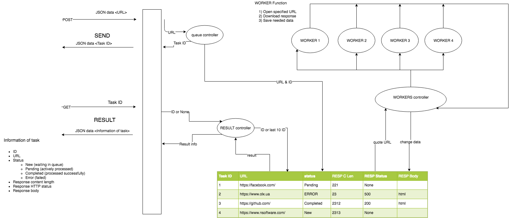

## Goal

Create a simple service prototype with a basic queue.

## “Send” method 
example:
  Post    <http://127.0.0.1:8888/send> json { "url": "https://stackoverflow.com/"}
  response {
  "url": "https://stackoverflow.com/",
  "task id": "1",
  "Error": "None"
}
  

**Receives** a POST request with data in JSON.

Request body has “URL” parameter.

**Returns** ID of a created task (JSON).

## “Result” method

  example:
  Get    <http://127.0.0.1:8888/send> json { "url": "https://stackoverflow.com/"}
  response {
  "id": "1",
  "url": "https://stackoverflow.com/",
  "Status": "Completed",
  "RESP C Len": 262012,
  "RESP Status": 200,
  "RESP Body": <html code>}
 
 

**Receives** a GET request with ID param.

**Returns**

A. If ID is not specified

Returns last 10 tasks with information on them in JSON format.

B. If ID is specified

Information about task with specified ID.

## Tasks

Service has queue of tasks that do following:

* Open specified URL
* Download response
* Save needed data
 
Only 4 tasks could be processed in async mode. If more tasks are created, they wait for available slots in queue.

Task has following data fields

* ID
* URL
* Status
  * New (waiting in queue)
  * Pending (actively processed)
  * Completed (processed successfully)
  * Error (failed)
* Response content length
* Response HTTP status
* Response body

